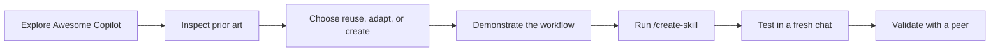

# Create Your First GitHub Copilot Skill

> Turn a successful Copilot Chat workflow into a reusable, testable Agent Skill with `/create-skill`.

## What is a skill?

A **skill is a saved recipe for Copilot**: it explains how to complete a specific task step by step.

- **Without a skill:** You explain the same process again in every chat.
- **With a skill:** Copilot can reuse the proven process, giving the whole team faster and more consistent results.

| | |
| --- | --- |
| **Level** | Beginner |
| **Duration** | 30-120 minutes, depending on the selected format |
| **Format** | Guided labs followed by peer validation |
| **Required** | Web browser, VS Code, and GitHub Copilot Chat |
| **You will build** | A workspace skill for active incident handoffs |

No prior knowledge of Agent Skills or Awesome Copilot is required.

## Why this workshop

A useful workflow discovered in one chat is easy to lose and difficult for a team to reuse. An Agent Skill turns that workflow into a versioned playbook that Copilot can discover for future tasks.

This workshop teaches the complete engineering loop:

1. Search for existing work before creating another solution.
2. Inspect public examples instead of trusting them blindly.
3. Demonstrate and refine the missing workflow in Chat.
4. Package it with `/create-skill`.
5. Test when the skill should and should not activate.
6. Prove that another person can use it without hidden context.

## Learning journey



## Before you start

You need:

- VS Code or VS Code Insiders with GitHub Copilot Chat;
- access to Agent mode in a trusted workspace;
- a browser that can open public GitHub pages; and
- a partner for the final peer challenge.

Read these three short guides in order:

| Guide | What it answers |
| --- | --- |
| [Core concepts](resources/core-concepts.md) | What is a skill, how is it discovered, and what does `/create-skill` do? |
| [Why Awesome Copilot matters](resources/why-awesome-copilot-matters.md) | Why do teams need a shared catalog, and why does public content still require review? |
| [Awesome Copilot repository tour](resources/awesome-copilot-repository-tour.md) | What is available in the public repository, and how do you inspect a skill? |

Awesome Copilot is a public, community-created collection. You will inspect its files in a browser, but you will not install the candidate skill used in this workshop.

## What you will learn

By the end of the workshop, you will be able to:

- explain what an Agent Skill is and how Copilot discovers one;
- navigate the main areas of the Awesome Copilot repository;
- distinguish skills from instructions, custom agents, plugins, and other resources;
- make an evidence-based reuse, adapt, or create decision;
- use conversation context as input to `/create-skill`;
- improve a generated `SKILL.md`; and
- validate explicit invocation, automatic discovery, exclusions, and peer usability.

## Scenario

A production incident is still active when responsibility moves to the next shift. The incoming responder needs verified facts, current impact, mitigation state, open questions, owners, and next actions.

Awesome Copilot contains an `incident-postmortem` skill, but a post-mortem is written after resolution. Your task is different: create an `incident-handoff` skill for transferring operational context while response work is still active.

## Choose your format

The workshop is modular. Choose the format based on the available time and the level of proof participants should leave with.

| Duration | Format | Participant outcome | Suggested coverage |
| --- | --- | --- | --- |
| **30 minutes** | Quick introduction | Understand skills, see public prior art, and observe `/create-skill` | Skill definition, repository tour, inspect `incident-postmortem`, facilitator demonstration |
| **60 minutes** | Core hands-on | Create a first `incident-handoff` skill | Condensed concepts and Labs 00-03 |
| **90 minutes** | Build and test | Create and behavior-test the skill in fresh chats | Condensed concepts and Labs 00-04 |
| **120 minutes** | Complete workshop | Create, test, improve, and peer-validate the skill | All concept guides, Labs 00-05, and debrief |

The 30-minute format is an introduction rather than the full hands-on experience. Use at least 60 minutes when every participant should create a skill.

## Workshop path

The agenda below shows the complete 120-minute format. For shorter sessions, use the coverage listed above and reduce discussion time rather than rushing every lab.

| Phase | Outcome | Time |
| --- | --- | ---: |
| Prepare | Read the three concept guides and discuss the ecosystem problem | 20 min |
| [Lab 00](labs/00-setup.md) | Confirm the concepts, workspace, command, and public catalog access | 10 min |
| [Lab 01](labs/01-discover-before-create.md) | Inspect prior art and decide whether to reuse, adapt, or create | 15 min |
| [Lab 02](labs/02-perform-workflow.md) | Perform and refine the incident-handoff workflow in Chat | 15 min |
| [Lab 03](labs/03-create-skill.md) | Generate the workspace skill with `/create-skill` | 20 min |
| [Lab 04](labs/04-test-and-improve.md) | Test discovery, exclusions, and trust behavior in fresh chats | 20 min |
| [Lab 05](labs/05-peer-challenge.md) | Validate the skill without author assistance | 15 min |
| Debrief | Compare results and capture lessons | 5 min |
| **Total** | | **120 min** |

## What you will create

Each participant creates this workspace artifact:

```text
.github/
`-- skills/
    `-- incident-handoff/
        `-- SKILL.md
```

Optional references, scripts, and templates come later, and only when the core workflow needs them.

## Definition of done

The skill is complete when:

- its folder and frontmatter name match;
- an explicit `/incident-handoff` request works;
- a natural-language shift-handoff request discovers it;
- a post-mortem request does not incorrectly select it;
- missing facts, owners, and impact figures are not invented; and
- another participant succeeds from a fresh chat without verbal coaching.

## Workshop rules

- **Search before building:** inspect existing skills before creating another one.
- **Inspect before trusting:** public and popular does not mean approved or correct.
- **Demonstrate before packaging:** perform the workflow before invoking `/create-skill`.
- **Use fictional data:** do not paste customer incidents, credentials, personal data, or internal URLs.
- **Test behavior, not wording:** generated skills can differ while satisfying the same contract.

## Facilitators

Review the [facilitator guide](facilitator-guide.md) before delivery. It includes the four delivery formats, teaching notes, checkpoints, fallback guidance, and intervention rules.

## Start the workshop

Open [Lab 00: Understand and Verify the Tools](labs/00-setup.md).

## Repository maintenance

After changing workshop content, run the dependency-free validation:

```powershell
pwsh -NoProfile -File ./scripts/Test-Workshop.ps1
```
