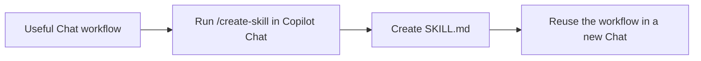
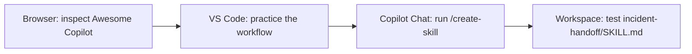
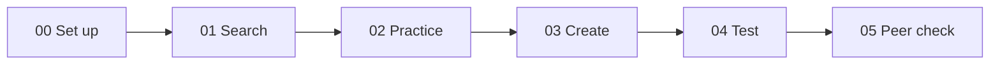

# 🧰 Build Your First GitHub Copilot Skill

Turn one useful Copilot Chat conversation into a reusable Agent Skill with `/create-skill`.

> [!IMPORTANT]
> **New to Agent Skills? Start with [Start here](#-start-here) and follow the numbered steps.** You do not need prior knowledge of Agent Skills or Awesome Copilot.

## 👋 What are you building?

A **skill is a saved recipe for Copilot**. It tells Copilot when to help, which steps to follow, and how to check the result.



In this workshop, you will turn an active incident-handoff workflow into this local file:

```text
.github/
`-- skills/
    `-- incident-handoff/
        `-- SKILL.md
```

| Workshop fact | Details |
| --- | --- |
| **Level** | Absolute beginner |
| **Duration** | 30-120 minutes |
| **Required** | Git, a browser, VS Code, and GitHub Copilot Chat |
| **Result** | One tested `incident-handoff` workspace skill |

## 🚦 Start here

### 1. Check what you need

Make sure you have:

- [Git](https://git-scm.com/downloads) installed;
- [VS Code](https://code.visualstudio.com/download) or VS Code Insiders;
- GitHub Copilot Chat enabled and signed in; and
- a browser that can open public GitHub pages.

To check Git, open PowerShell or another terminal and run:

```powershell
git --version
```

You are ready when the command prints a Git version instead of an error.

### 2. Clone this workshop

Run the next three commands in **PowerShell or another terminal**, one at a time:

```powershell
git clone https://github.com/annawiewer/Skill_hands-on.git
```

```powershell
cd Skill_hands-on
```

```powershell
code .
```

If `code .` fails, open VS Code, select **File > Open Folder**, and choose the `Skill_hands-on` folder.

### 3. Trust and check the workspace

1. Confirm **Workspace Trust** when VS Code asks.
2. Open the VS Code Explorer.
3. Check that your workspace looks like this:

   ```text
   Skill_hands-on/
   |-- README.md              Start and overview
   |-- labs/                  Steps you complete in order
   |-- resources/             Short explanations and checklists
   |-- scenarios/             Fictional practice data
   |-- solutions/             Reference answer for comparison
   `-- scripts/               Repository validation
   ```

If you see these folders, you opened the correct workspace.

### 4. Open Copilot Chat

1. Open **GitHub Copilot Chat** in VS Code.
2. Select **Agent** mode.
3. Type `/` in the Chat input and confirm that `/create-skill` appears.
4. Do not run it yet.

`/create-skill` is a **Copilot Chat command**. Do not run it in PowerShell or another terminal.

### 5. Begin the workshop

Open [Lab 00: Understand and Verify the Tools](labs/00-setup.md) and complete every step in order.

## 🗺️ Know which repository you are using

This workshop uses two public repositories for different jobs:

| Repository | Where you use it | What you do |
| --- | --- | --- |
| `annawiewer/Skill_hands-on` | Your local VS Code workspace | Clone it, edit files, and build your skill |
| `github/awesome-copilot` | Your web browser | Inspect public examples only |

**Do not clone Awesome Copilot.** You will browse it on GitHub and return to your local workshop workspace to create files.



The browser is for research. VS Code and Copilot Chat are where you do the hands-on work.

## 📚 Read these short primers

Lab 00 tells you when to read each guide:

1. [Core concepts](resources/core-concepts.md): understand skills and `/create-skill`.
2. [Why Awesome Copilot matters](resources/why-awesome-copilot-matters.md): understand shared catalogs and trust.
3. [Awesome Copilot repository tour](resources/awesome-copilot-repository-tour.md): learn what to inspect in a public skill.

## Workshop path 🧭

Complete the labs from left to right. Each lab has numbered steps and a checkpoint.



| Lab | What you do | Time |
| --- | --- | ---: |
| [Lab 00: Set up](labs/00-setup.md) | Verify the workspace, Chat command, and public catalog | 10 min |
| [Lab 01: Search](labs/01-discover-before-create.md) | Compare your need with an existing public skill | 15 min |
| [Lab 02: Practice](labs/02-perform-workflow.md) | Build a reliable incident handoff in Chat | 15 min |
| [Lab 03: Create](labs/03-create-skill.md) | Run `/create-skill` and inspect the generated file | 20 min |
| [Lab 04: Test](labs/04-test-and-improve.md) | Test when the skill should and should not run | 20 min |
| [Lab 05: Peer check](labs/05-peer-challenge.md) | Ask another participant to test without hidden context | 15 min |

For the complete experience, allow 120 minutes including reading and discussion. Shorter 30-, 60-, and 90-minute sessions can stop after the matching checkpoint.

## 🎯 Practice scenario

A production incident is still active when responsibility moves to the next shift. The incoming responder needs verified facts, current impact, mitigation status, open questions, owners, and next actions.

Awesome Copilot has an `incident-postmortem` skill for learning after an incident is resolved. You need something different: an `incident-handoff` skill for transferring operational context while response work is still active.

## ✅ You are finished when

- `.github/skills/incident-handoff/SKILL.md` exists;
- `/incident-handoff` works in a fresh Copilot Chat;
- a normal shift-handoff request finds the skill automatically;
- a post-mortem request does not select the skill;
- the output does not invent facts, owners, or impact figures; and
- another participant can use the skill without your help.

## 🆘 If you get stuck

| Problem | What to do next |
| --- | --- |
| `git` is not recognized | Install Git, close the terminal, open a new terminal, and run `git --version` again |
| `code .` does not work | Open VS Code, select **File > Open Folder**, and choose `Skill_hands-on` |
| `/create-skill` is missing | Confirm Copilot Chat is signed in, update VS Code and the extension, then reload the window |
| Awesome Copilot is blocked | Use the local [discovery snapshot](resources/awesome-copilot-discovery-snapshot.md) |
| Your result differs from the example | Finish your tests first, then compare with the [reference skill](solutions/incident-handoff/SKILL.md) |

## 🔐 Workshop rules

- Use only the fictional files in this repository. Never paste customer incidents, credentials, personal data, or internal URLs.
- Search before creating a new skill.
- Inspect public content before trusting or reusing it.
- Demonstrate the workflow before running `/create-skill`.
- Test behavior rather than expecting identical wording.

## 🧪 Repository check

After changing workshop content, run the command for your operating system from the repository root.

Windows:

```powershell
pwsh -NoProfile -File ./scripts/Test-Workshop.ps1
```

macOS or Linux:

```bash
bash ./scripts/Test-Workshop.sh
```
