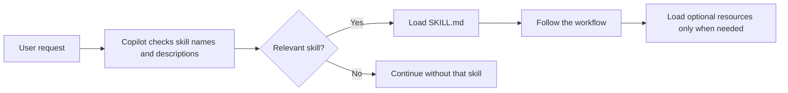

# Core Concepts

Read this page before starting the labs. You do not need prior experience with GitHub Copilot customizations.

## What is an Agent Skill?

An Agent Skill is a reusable playbook for GitHub Copilot. It tells Copilot how to complete a specific kind of task, including the steps to follow, decisions to make, and checks that define a good result.

A workspace skill is a folder in the repository:

```text
.github/skills/<skill-name>/
├── SKILL.md
├── references/    # Optional supporting guidance
├── scripts/       # Optional executable helpers
└── assets/        # Optional templates or other output resources
```

Only `SKILL.md` is required. Its frontmatter contains a name and description, followed by the workflow instructions:

```markdown
---
name: incident-handoff
description: 'Create a shift handoff for an active incident. Use when incident ownership changes between responders.'
---

# Incident Handoff

1. Identify confirmed facts.
2. Separate hypotheses from facts.
3. List the current state and next actions.
4. Check that no missing details were invented.
```

The description is especially important. Copilot uses it to decide whether the skill is relevant to a natural-language request. A user can also invoke a user-visible skill explicitly with `/skill-name`.



## What a skill is not

- It does not train or fine-tune the AI model.
- It is not a VS Code extension.
- It is not an external API connection.
- It does not need executable code for a text-based workflow.

Use a skill when a repeatable, on-demand task needs several steps, decision rules, or supporting resources.

## What is `/create-skill`?

`/create-skill` is a built-in GitHub Copilot Chat workflow that helps create the skill folder and `SKILL.md`.

It reviews the current conversation for:

- the steps that produced a useful result;
- decisions and branching rules; and
- quality checks that indicate completion.

If the conversation does not contain enough detail, `/create-skill` asks what the skill should produce, whether it is for one workspace or the user, and whether it needs a checklist or a full workflow.

This is why the workshop performs the incident-handoff task before invoking `/create-skill`.

## What is Awesome Copilot?

[Awesome GitHub Copilot](https://github.com/github/awesome-copilot) is a **public GitHub repository** containing community-created agents, instructions, skills, hooks, workflows, and plugins. It can be browsed without access to a private customer repository. The project is MIT licensed.

The collection is useful for two reasons:

1. You can reuse an existing customization instead of maintaining another copy.
2. You can inspect good examples before designing your own customization.

The repository includes contributions from third parties. Inspect a customization and its bundled scripts before installing or using it in a customer environment.

This summary explains what the collection is. Continue with [Why Awesome Copilot Matters](why-awesome-copilot-matters.md) for the deeper ecosystem problem, evidence of adoption, enterprise value, and important limits. Use the [Awesome Copilot Repository Tour](awesome-copilot-repository-tour.md) to learn where each resource type lives and how to inspect a skill.

## Where to explore Awesome Copilot

The workshop uses public web pages only:

| Item | Meaning in this workshop |
| --- | --- |
| [GitHub repository](https://github.com/github/awesome-copilot) | The public source files, history, contributors, and license |
| [Skills index](https://github.com/github/awesome-copilot/blob/main/docs/README.skills.md) | A table you can search with the browser's Find command |
| [Skills website](https://awesome-copilot.github.com/skills/) | A visual catalog with search, descriptions, update dates, and file counts |
| [Learning Hub](https://awesome-copilot.github.com/learning-hub/) | Beginner articles, terminology, tutorials, and hands-on material |

Browsing Awesome Copilot does not create or install anything in your project. `/create-skill` creates the new skill from your conversation later in the workshop.

## How the pieces fit together

```text
Awesome Copilot repository -> search and inspect prior art
Conversation in Copilot Chat -> demonstrate the desired workflow
/create-skill               -> package that workflow as SKILL.md
Fresh chat and peer test    -> prove the skill is reusable
```

## Quick knowledge check

1. Where does the reusable workflow live? In the skill's `SKILL.md`.
2. What helps Copilot decide when to load a skill? Its frontmatter description.
3. Is Awesome Copilot publicly accessible? Yes, the repository is public.
4. Does browsing an Awesome Copilot skill install it? No, you are only inspecting public files.
5. Why perform the workflow before `/create-skill`? The conversation provides the steps, decisions, and quality checks to package.
